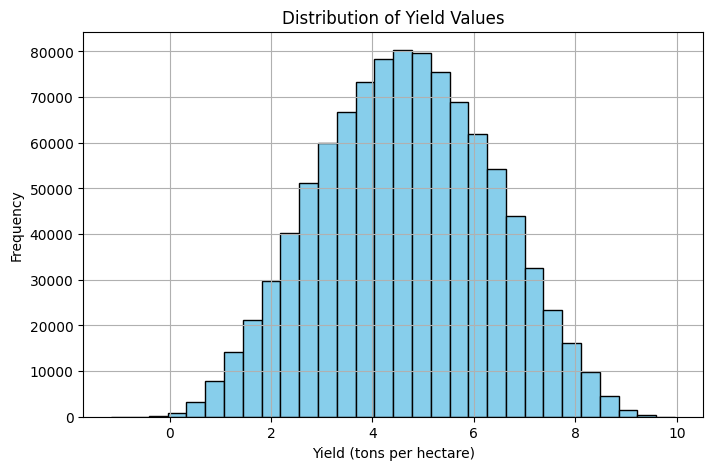

# Linear Regression Model - Crop Yield Prediction

**Mission:** My mission is to enhance agriculture in Africa, empowering the continent to achieve self-sufficiency in agricultural production for a variety of needs.

This project integrates a linear regression model, an API, and a Flutter app to support data-driven crop yield prediction. By providing accurate yield forecasts, the tools help farmers and stakeholders in Africa plan better, optimize resources, and increase productivity.

## Brief Description and Source of Data
Dataset Source: [Source](https://www.kaggle.com/datasets/samuelotiattakorah/agriculture-crop-yield/data)

The dataset contains historical crop yield data, including various factors such as weather conditions, soil quality, and farming practices. This data is used to train the linear regression model to predict future crop yields. The dataset was sourced from Kaggle 

Correlation Heatmap

Feature Distribution

## Public API Endpoint
[API Endpoint](https://linear-regression-model-9w94.onrender.com/docs)

## Demo Video
[Demo](https://www.bugufi.link/MtmjcM)

## Running the Mobile App
- Ensure Flutter is installed.
- Navigate to `summative/FlutterApp/`.
- Run `flutter pub get`.
- Connect your emulator or device.
- Run `flutter run`.

## Structure
- `summative/linear_regression/`: Google Colab notebook for Task 1.
- `summative/API/`: FastAPI app and model artifacts for Task 2.
- `summative/FlutterApp/`: Flutter app for Task 3.